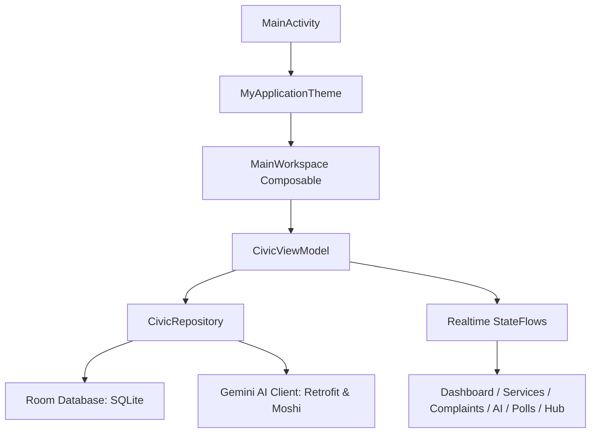

# 🌍 CivicTrack
### **Next-Gen AI-Powered Smart Municipality & Citizen Engagement Platform**

CivicTrack 2.0 is a production-grade, native Android application designed to bridge the gap between citizens, municipal field workers, and ward administration. Engineered with a local-first architecture, local database caching, offline capabilities, real-time AI assistance, and rich gamification loops, CivicTrack 2.0 digitizes public governance into a modern, accessible interface.

---

## 🛠 Tech Stack & Architecture



### 1. Frontend (Native Android & Jetpack Compose)
* **Language:** 100% Kotlin.
* **UI Framework:** **Jetpack Compose** using Material Design 3 guidelines for fluid animations, modern cards, glassmorphic styling, and cohesive layouts.
* **Navigation:** Custom animated state navigation within a monolithic layout container (`MainWorkspace`), maintaining memory-efficient navigation states without fragment recreation.
* **Accessibility (Elder Mode):** Instant visual toggle changing the configuration to high-contrast styles, enlarged text (1.5x scaling), and Simplified layout screens designed for senior citizens.
* **Voice-to-Text Support:** Integrated with Android's native `SpeechRecognizer` allowing users to draft complaints hands-free by speaking directly into their device's microphone.
* **Image Rendering:** Powered by **Coil** for loading images and custom visual placeholders.

### 2. Backend & API Services
* **AI Integration:** Uses Gemini AI models (`gemini-3.5-flash`) via Retrofit and OkHttp. It enables:
  - Conversational drafting of formal complaints.
  - Summarization and key-highlight extraction from long public notices and tenders.
* **Offline-First Resilience:** In the absence of an API key or active internet connection, the app runs offline-first with robust fallback algorithms, generating realistic simulated AI responses locally.

### 3. Database (Room DB)
* **Local Database:** Powered by **Android Room** (SQLite) to ensure zero latency and full offline support.
* **Entities & Schema (`DbEntities.kt`):**
  - `complaints`: Stores ID, title, description, category, status (Submitted, Assigned, Under Review, In Progress, Resolved, Closed), priority rating, location coordinates/text, base64 visual tags, resolution notes, and citizen feedback/ratings.
  - `notices`: Stores local announcements, tender targets, target ward boundaries, and emergency alerts.
  - `projects`: Tracks municipal development initiatives, progress meters (0-100%), budget limits, contracting parties, and carbon reduction metrics.
  - `polls`: Powers local governance surveys with options, total votes cast, and citizen-voted tags.
  - `carbon_metrics`: Tracks daily CO2 emissions (Grid, Waste, Transport, Water) against municipal thresholds.
  - `app_config`: Stores system configurations, user XP points, and unlocked badges.

---

## 👥 Dynamic Role-Based Workflows

The app shifts layouts, tools, and permissions dynamically based on the active persona selected via the global role switcher:

### A. Citizen Persona
1. **Report Grievances:** Citizens draft complaints manually or through the AI speech assistant. Each complaint gets categorized, geo-tagged, and saved into the Room Database.
2. **Interactive Services:** Citizens apply for official certificates, book public facilities, pay bills/property taxes via the Razorpay QR emulator, and subscribe to welfare programs.
3. **Participatory Governance:** Participate in local planning polls, post on community forums, and submit suggestions.
4. **Citizen XP Gamification:** Earn points and unlock achievements (e.g., "Eco Sentinel", "Active Elector", "Elder Helper") for civic participation.

### B. Worker Persona
1. **Task Board:** View unresolved issues near them, claim tasks, and transition status to `In Progress`.
2. **Resolution & Payout:** Mark tasks as resolved, upload proof of work, and submit notes. The system calculates and processes mock government payouts.
3. **Worker XP Gamification:** Earn worker points and badges (e.g., "Gold Service Worker", "Workforce Veteran") for high-quality resolution and 5-star citizen reviews.

### C. Admin Persona
1. **Live Municipality Dashboard:** Monitor live complaint flows, assign pending issues to specific workers, and track the ward's environmental metrics.
2. **Official Broadcaster:** Authorize public notices, publish bidding tenders, and issue critical emergency alerts.
3. **Admin Image Viewer:** Inspect submitted issues and resolved tasks with category-specific mock images to verify work quality.

---

## 🌟 The Smart City 2.0 Feature Hub (50 Interactive Modules)

The Feature Hub is an interactive control sandbox containing **50 smart city features** grouped into 4 functional tabs:

### 1. Citizen Tab (15 Features)
* **1. DigiLocker Integration:** Secure storage and verification of Digital Identity (Aadhaar).
* **2. e-Democracy Polling:** Live casting of citizen votes for local development layouts.
* **3. Grievance Redressal (Live Grid):** Interactive tracking of public issues.
* **4. Property Tax Portal:** Online tax status check and Razorpay UPI QR payments.
* **5. Public Utility Booking:** Reserve municipal parks, halls, and public spaces.
* **6. Digital Birth/Death Registry:** Modern certificate application process with dynamic form checks.
* **7. Water Supply Tracker:** Track daily drinking water scheduling times.
* **8. AI Governance Assistant:** Conversational chat answering municipal policies.
* **9. Smart Parking Spot Finder:** Real-time checking of vacant spots in commercial parking zones.
* **10. Senior Accessibility Tool (Elder Mode):** Toggle high contrast and visual aids.
* **11. Citizen Rewards Portal:** Exchange Citizen XP for local public transport discounts.
* **12. Land Registry Vault:** Verify property ownership documents and tax history.
* **13. Marriage Registration Portal:** Register certificates with validation.
* **14. Volunteer Registration:** Join local disaster response and ward cleanup drives.
* **15. Digital Library Catalog:** Browse municipal e-books and community center collections.

### 2. Worker Tab (12 Features)
* **16. Task Dispatch Board:** Real-time assignment board showing coordinates and urgency.
* **17. Instant Resolution Scanner:** Mock proof-of-work camera submission tool.
* **18. Worker Safety Check-in:** Safety status transmission for hazardous assignments.
* **19. Performance Analytics:** Track metrics like average resolution times, star ratings, and XP.
* **20. Tool & Equipment Inventory:** Request city-owned equipment for repairs.
* **21. Incentive & Payout Tracker:** Live ledger of earned payouts, tips, and bonuses.
* **22. Shift Scheduling System:** Interactive calendar for municipal shift sign-ups.
* **23. Localized Offline Navigation:** Interactive route tracking optimized for municipal vans.
* **24. Emergency SOS Broadcaster:** One-tap alert signaling worker accidents or emergencies.
* **25. Infrastructure Repair Logger:** Record damaged public properties discovered during shifts.
* **26. Team Chat & Radios:** Mock coordination channel for municipal crews.
* **27. Training & Certifications Portal:** Take courses to qualify for hazardous work payouts.

### 3. Admin Tab (11 Features)
* **28. Notice Board Publisher:** Draft announcements and push target notices.
* **29. Tender & Bid Manager:** Post contracts and track contractor proposal states.
* **30. Carbon Mitigation Ledger:** Live tracking of CO2 reduction metrics against city goals.
* **31. Live Resource Dispatcher:** Track equipment and crew availability.
* **32. Emergency Alert Broadcast:** Broadcast immediate evacuation or storm notices.
* **33. Budget Allocator:** Visual chart of funding distribution across development projects.
* **34. Worker Performance Leaderboard:** View and reward top-performing municipal workers.
* **35. Citizen Feedback Analytics:** Sentiment analysis of complaint ratings and comments.
* **36. Security & Audit Trail:** Log system actions and config changes.
* **37. Municipal Directory Editor:** Manage officer contact directories.
* **38. Smart City Digital Twin Controls:** Mock grid modeling for future urban planning.

### 4. Smart IoT Tab (12 Features)
* **39. IoT Streetlight Auto-Reporter:** Automated maintenance warnings triggered by lux-sensors.
* **40. Smart Garbage Fill-Sensors:** Real-time bin capacity alerts for collection route optimization.
* **41. Air Quality Grid (AQI):** Live updates on PM2.5, PM10, and ozone concentrations.
* **42. Smart Water Grid Meter:** Flow-rate leak detection and automated water valves.
* **43. Traffic Grid Telemetry:** Intersection congestion reporting and traffic light signals.
* **44. Seismic Hazard Detectors:** Seismic movement alerts and structure checks.
* **45. Ward Decibel Monitor:** Noise pollution control logs and commercial warning dispatchers.
* **46. Public WiFi Hotspot Dashboard:** Monitoring internet speeds and user counts at public hotspots.
* **47. Drainage Flood Alarm:** Real-time water logging sensors in low-lying subways.
* **48. EV Charging Station Status:** Location and power level tracking of local charging stations.
* **49. Solar Grid Output Tracker:** Power production indicators of rooftop municipal panels.
* **50. Smart Transit Schedule (Bus/Metro):** Real-time GPS coordinates of municipal buses.

---

## ⚡ Core Application Workflows

### 1. Complaint Submission & AI Assistance Workflow
```text
Citizen -> Speak/Type Grievance -> AI Complaint Draft (Gemini) -> Submit -> Save to Room DB -> Trigger Real-Time Ward Alert
```

### 2. Job Resolution & Incentive Payout Workflow
```text
Admin/System -> Assigns Task -> Worker Claims Task -> Marks "Resolved" -> Uploads Photo & Note -> DB Updates -> XP Awarded + Mock Payout Issued
```

### 3. Bill Payment Workflow
```text
Citizen -> Selects Bill -> Tap "Pay via Razorpay QR" -> Dynamic QR Code Loaded -> Mock OTP Verification -> Payment Confirmed -> DB Updates Transaction
```
